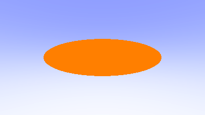
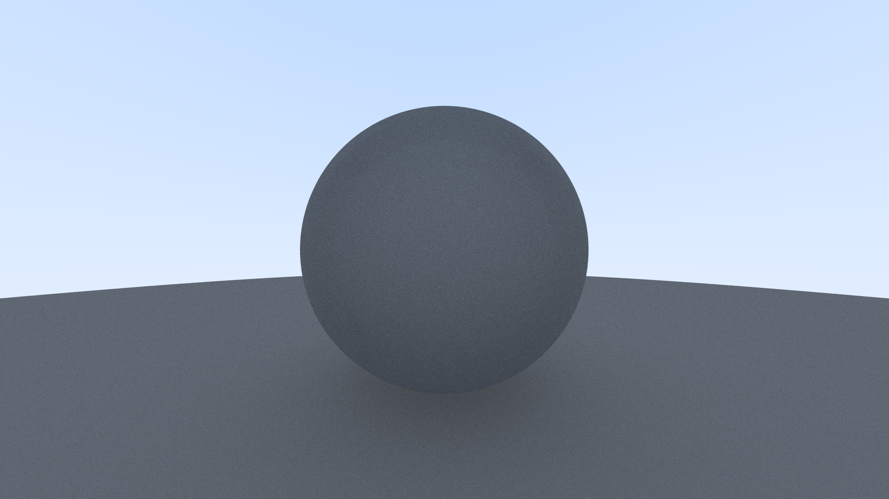

# ray_tracing_rust

Um renderizador baseado em Ray Tracing escrito em Rust, implementando segundo a orientação do livro Ray Tracing In One Weekend.

## Primeiro commit

## Cálculo das normais

## Suporte a múltiplos objetos 

## Implementação de Antialiasing

## Implementação de material difuso

#### Fonte: [Ray Tracing In One Weekend](https://raytracing.github.io/books/RayTracingInOneWeekend.html)